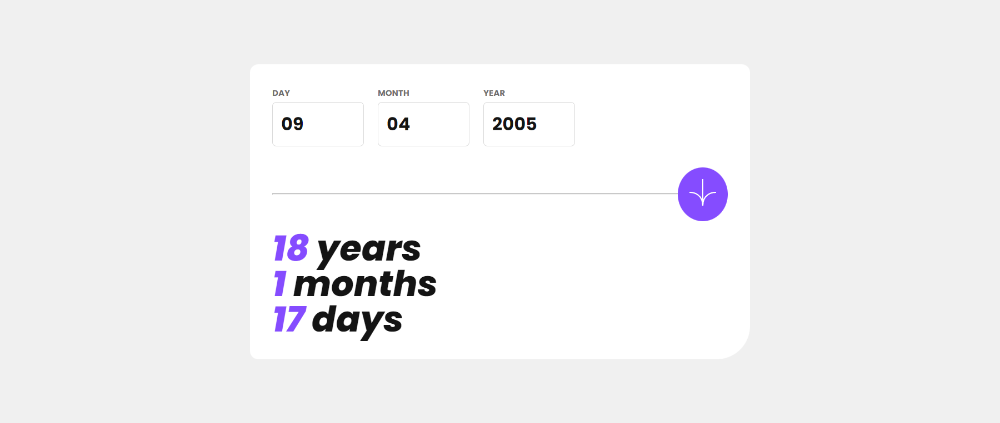
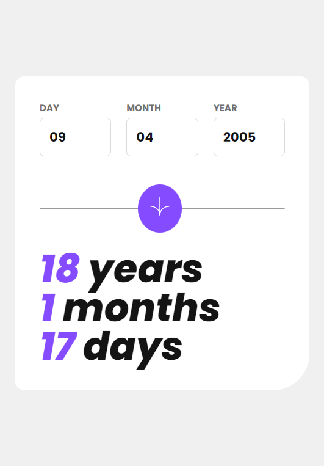

# Age Calculator App

## :calendar: Projeto

Desafio da Frontend Mentor, que é uma calculadora de idade do usuário com base na sua data de nascimento. 

## :art: **Visual do Projeto**

### _Desktop e Telas Maiores_

<h1 align="center">
    
</h1>

### _Mobile e Telas Menores_

<h1 align="center">
    
</h1>

## :wrench: **Tecnologias**

### :hammer: **Construção do site**

- [JavaScript](https://developer.mozilla.org/pt-BR/docs/Web/JavaScript)
- [HTML](https://developer.mozilla.org/pt-BR/docs/Web/HTML)

### :art: **Estilização**

- [CSS](https://developer.mozilla.org/pt-BR/docs/Web/CSS)
- [Google Fonts]([https://fonts.google.com](https://developer.mozilla.org/pt-BR/docs/Web/HTML))

### :open_file_folder: **IDE, Versionamento e Deploy**

- [Visual Studio Code](https://code.visualstudio.com)
- [Git](https://git-scm.com)
- [GitHub](https://github.com)

## :rocket: **Configurações e Instalação**

```sh
# Clonando o projeto
git clone https://github.com/davsilvam/movieshelf.git
```

<p align="center">
  Feito com :purple_heart: por <a href="https://www.linkedin.com/in/davsilvam/">David Silva</a>.
</p>

---
